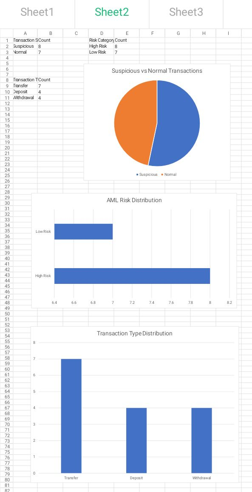

# ANTI-MONEY LAUNDERING (AML) ANALYSIS USING SUSPICIOUS TRANSACTION MONITORING

## AML Analytics Project

## Dashboard Preview

AML dashboard showing suspicious transaction trends, risk distribution, and transaction type insights.

## Project Files

- Dataset: [Download AML Dataset](aml_dataset.xlsx)

## OBJECTIVE

- To identify suspicious financial transactions using AML risk scoring, transaction monitoring, and data analytics techniques.

## DATASET

Simulated AML transaction dataset containing:

- Transaction ID
- Customer ID
- Transaction Amount
- Transaction Type
- Transaction Frequency
- Country Risk Level
- AML Risk Score
- Suspicious Flag
- Alert Status

## METHODOLOGY

- Data cleaning
- Descriptive statistics
- Transaction monitoring
- AML risk scoring
- Suspicious transaction detection

## AML DETECTION RULES

- Transaction above ₦5,000,000 = High AML Risk
- Frequent transfers = Suspicious
- High-risk country transaction = AML Alert

## TOOLS USED

- Microsoft Excel
- Data Analytics
- Risk Scoring
- Python (Learning)

## KEY FINDINGS

- Large transactions showed higher AML risk
- Frequent transfers increased suspicious activity
- High-risk country transactions triggered AML alerts
- Suspicious activities were concentrated among large transfers

## EXPECTED OUTCOME

- Improved understanding of AML monitoring, suspicious transaction detection, and financial crime prevention.

## FUTURE IMPROVEMENTS

- Expand dataset to 500+ transactions
- Build AML dashboard
- Apply machine learning models
- Upgrade analysis using Python and Scikit-learn

## RESEARCH RELEVANCE

This project aligns with my research interests in:

- Financial Crime Detection
- Anti-Money Laundering
- Artificial Intelligence
- Machine Learning
- Risk Analytics
