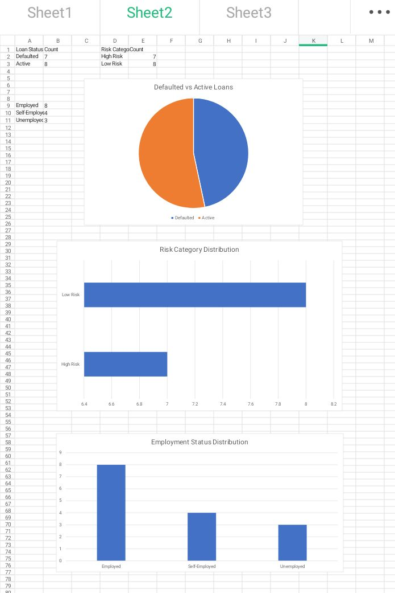

<section>
<h2>Credit Risk Analytics Project</h2>

<b>Credit Risk Analysis Using Customer Financial Behaviour</b>

This project focuses on assessing customer creditworthiness using financial behaviour, credit risk indicators, and data analytics techniques.

<ul>
<li>Credit Risk Assessment</li>
<li>Customer Financial Behaviour Analysis</li>
<li>Risk Scoring</li>
<li>Loan Default Prediction</li>
</ul>

<h3>Objective</h3>

To assess customer creditworthiness using financial behaviour, risk indicators, and data analytics techniques.

<h3>Dataset</h3>
<ul>
<li>Customer ID</li>
<li>Monthly Income</li>
<li>Loan Amount</li>
<li>Debt-to-Income Ratio</li>
<li>Credit Score</li>
<li>Loan Duration</li>
<li>Repayment History</li>
<li>Employment Status</li>
<li>Risk Category</li>
<li>Loan Default Status</li>
</ul>

<h3>Methodology</h3>
<ul>
<li>Data cleaning</li>
<li>Descriptive statistics</li>
<li>Credit behaviour analysis</li>
<li>Risk scoring</li>
<li>Default prediction analysis</li>
</ul>

<h3>Credit Risk Rules</h3>
<ul>
<li>Credit Score below 50 = High Risk</li>
<li>Debt-to-Income Ratio above 40% = High Risk</li>
<li>Loan Default Status = Defaulted Customer</li>
</ul>

<h3>Tools Used</h3>
<ul>
<li>Microsoft Excel</li>
<li>Data Analytics</li>
<li>Risk Scoring</li>
<li>Python (Learning)</li>
</ul>
</section>

## Dashboard Preview

Credit risk dashboard showing loan default trends, risk distribution, and customer employment insights.

## Project Files

- Dataset: [Download Credit Risk Dataset](credit_risk_dataset.xlsx)
