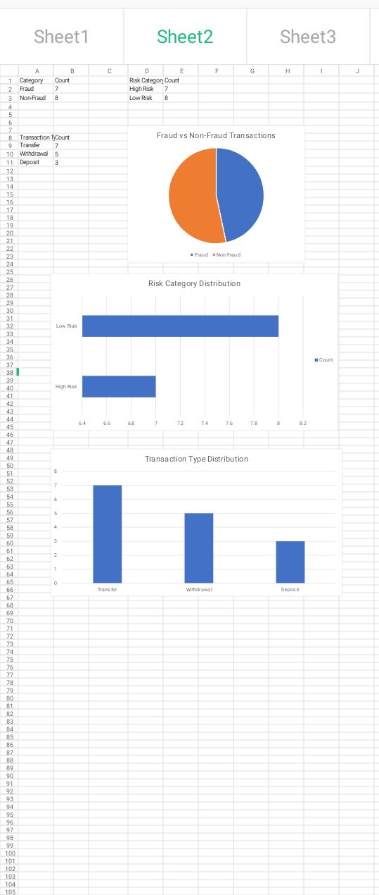

# FRAUD DETECTION ANALYSIS USING TRANSACTION PATTERN MONITORING

## Fraud Detection Project

## Dashboard Preview

Fraud analytics dashboard showing transaction monitoring, risk distribution, and fraud insights.

## OBJECTIVE

- To identify potentially fraudulent financial transactions using transaction monitoring, risk scoring, and data analytics techniques.

## DATASET

Simulated banking transaction dataset containing:

- Transaction ID
- Customer ID
- Amount
- Transaction Type
- Frequency
- Risk Score
- Fraud Flag
- Risk Category
- Transaction Status

## METHODOLOGY

- Data cleaning
- Descriptive statistics
- Transaction pattern analysis
- Fraud risk scoring
- Identification of suspicious transactions

## FRAUD DETECTION RULES

- Risk Score above 75 = High Risk
- Fraud Flag = Yes = Suspicious Transaction

## TOOLS USED

- Microsoft Excel
- Data Analytics
- Risk Scoring
- Python (Learning)

## KEY FINDINGS

- High-value transactions showed higher fraud risk
- Frequent withdrawals were more likely to be suspicious
- Transactions with high risk scores were flagged as high risk
- Suspicious transactions were concentrated among withdrawals and transfers

## EXPECTED OUTCOME

- Improved understanding of transaction patterns, fraud indicators, and risk detection within financial systems.

## FUTURE IMPROVEMENTS

- Expand dataset to 500+ transactions
- Build fraud dashboard
- Apply machine learning models
- Upgrade analysis using Python and Scikit-learn

## RESEARCH RELEVANCE

This project aligns with my research interests in:

- Financial Fraud Detection
- Artificial Intelligence
- Machine Learning
- Risk Analytics
- Financial Crime Prevention
