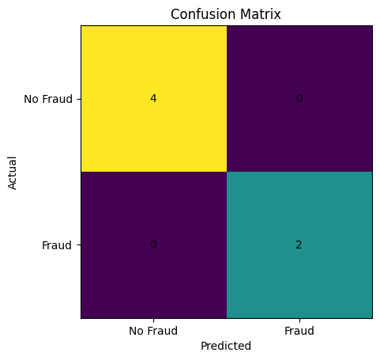

# PYTHON-BASED FRAUD DETECTION MODEL USING MACHINE LEARNING

## Python Fraud Detection Project

## OBJECTIVE

- To build a machine learning model for predicting fraudulent financial transactions using Python and data analytics techniques.

## DATASET

Simulated fraud dataset containing:

- Transaction ID
- Customer ID
- Transaction Amount
- Transaction Type
- Transaction Frequency
- Risk Score
- Fraud Flag

## METHODOLOGY

- Data collection
- Data cleaning
- Feature selection
- Model training
- Model evaluation

## MACHINE LEARNING MODEL

- Logistic Regression

## TOOLS USED

- Python
- Pandas
- NumPy
- Scikit-learn
- Matplotlib

## PROJECT FILES

- Dataset: [Download Fraud ML Dataset](fraud_ml_dataset.xlsx)
- Python Script: [View Python Script](fraud_detection.py)
- Jupyter Notebook: [View Notebook](Fraud_Detection_Project.ipynb)

## PYTHON LIBRARIES

- Pandas
- NumPy
- Scikit-learn
- Matplotlib

## MODEL EVALUATION

Performance metrics used:

- Accuracy
- Precision
- Recall
- Confusion Matrix

## MODEL RESULTS

The Logistic Regression model was trained using transaction amount, transaction type, transaction frequency, and risk score indicators to classify transactions as fraudulent or non-fraudulent.

### Confusion Matrix

### Model Performance

- Accuracy: 100%
- Precision: 100%
- Recall: 100%

### Interpretation

- The model correctly classified all transactions in the test dataset.
- High-risk transactions were accurately identified as fraudulent.
- Legitimate transactions were correctly classified as non-fraudulent.
- The results demonstrate the potential of machine learning techniques for financial fraud detection.

## EXPECTED OUTCOME

- Improved fraud prediction accuracy using machine learning and predictive analytics.

## FUTURE IMPROVEMENTS

- Expand dataset to 1000+ transactions
- Test advanced ML models
- Build real-time fraud detection system
- Deploy model as web application

## RESEARCH RELEVANCE

This project aligns with my research interests in:

- Financial Fraud Detection
- Artificial Intelligence
- Machine Learning
- Predictive Analytics
- Risk Analytics
